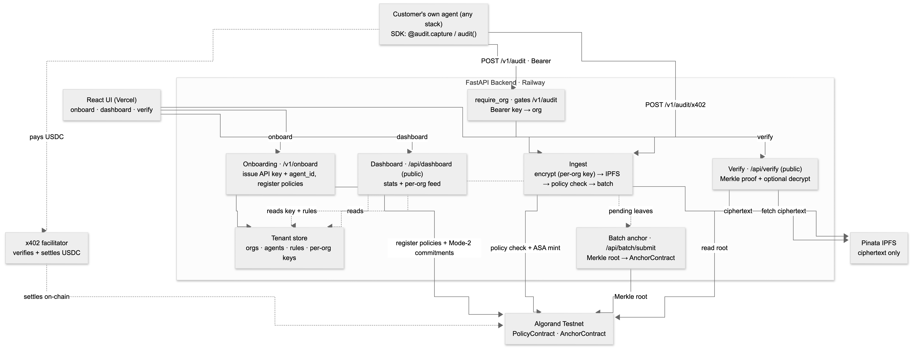

# AgentAudit Architecture

How a single agent decision becomes a tamper-evident, independently verifiable on-chain record.

---

## System Overview



```
   ┌────────────────────────────────────┐   ┌────────────────────────────────────┐
   │   Customer's own agent (any stack)  │   │          React UI (Vercel)          │
   │   SDK: @audit.capture / audit()     │   │    onboard · dashboard · verify     │
   └──────────────────┬──────────────────┘   └──────────────────┬──────────────────┘
                      │                                          │
      POST /v1/audit (Bearer key)              /v1/onboard · /api/dashboard · /api/verify
      POST /v1/audit/x402 ─(USDC)─┐                              │
                      │           ▼                              │
                      │   ┌───────────────────┐                 │
                      │   │  x402 facilitator  │                 │
                      │   │ (settles payment)  │                 │
                      │   └───────────────────┘                 │
                      ▼                                          ▼
   ┌──────────────────────────────────────────────────────────────────────────────┐
   │                          FastAPI Backend (Railway)                             │
   │   require_org ─▶ Tenant store (orgs · agents · rules · per-org keys)            │
   │   ingest: encrypt (per-org key) → IPFS → policy check → batch                   │
   │   anchor: Merkle root → AnchorContract        verify: proof + decrypt           │
   └──────────────────┬─────────────────────────────────────┬───────────────────────┘
                      │ ciphertext                           │ policy check + Merkle root
                      ▼                                       ▼
            ┌──────────────────┐                   ┌──────────────────────┐
            │   Pinata IPFS    │                   │       Algorand        │
            │   (ciphertext)   │                   │    PolicyContract     │
            └──────────────────┘                   │    AnchorContract     │
                                                   └──────────────────────┘
```

---

## Six Layers

### 1. Tenancy & Provisioning Layer - `tenancy/`
The platform is multi-tenant. `provisioning.py` onboards an org: it issues a hashed **API key** (`aa_…`), a system-issued **opaque agent ID** (`agt_…`), and a **per-org encryption key**, then registers the agent's policy set both on-chain and in the store. `store.py` is the SQLite tenant store (orgs, agents, policy rules). Every `/v1` ingest call is resolved to its org by `require_org` (hashed Bearer key lookup); tenants are isolated by `org_id`, and on-chain box namespaces are keyed `sha256(org_id + agent_id + idx)`.

### 2. Ingest Layer - `/v1/audit`, SDK, `agent/payment_agent.py`
The platform **ingests finished decisions from the customer's own agent** — it does not run the agent. A customer integrates the SDK (`agentaudit/client.py`: `audit.audit(...)` or the `@audit.capture` decorator) and submits `{decision, fields, reasoning_trace}`. The **reasoning trace** `[{step, tool, args, result}]` is supplied by the customer and stored inside the encrypted record, so tampering with it breaks the Merkle proof. The built-in LangChain + Groq agent (`payment_agent.py`, `run_payment_agent` / `run_chat_agent`) is only the **demo** agent behind `/api/chat`; it stands in for a customer's agent.

### 3. Crypto Layer - `crypto/payload.py`
AES-GCM-256: fresh 96-bit nonce per encryption, 128-bit auth tag. The key is **per-org** — `enc_key_hex` from the tenant store ([sdk/audit_flow_v2.py](sdk/audit_flow_v2.py)), not a single global key. Auditors decrypt by passing that org's key in the `X-Auditor-Key` header — used once and discarded.

### 4. Storage Layer - `ipfs/uploader.py`
Encrypted envelopes → Pinata IPFS → CID. Anyone can fetch the blob; without the key it's opaque. This is what lets us anchor a public hash without leaking record contents.

### 5. Smart Contract Layer - `contracts/`
Two contracts (see [CONTRACTS.md](CONTRACTS.md)):
- **PolicyContract** — per-action policy check against the agent's registered rule set (amount limits, whitelists, custom predicates), mints 1 AACR receipt if all checks pass. No on-chain record storage.
- **AnchorContract** — stores Merkle roots of batched records. One transaction anchors many decisions.

**Public vs private policies.** A rule is either **Mode 1 (public)** — the predicate is on-chain and enforced by PolicyContract — or **Mode 2 (private)** — only a SHA-256 **commitment** of the rule goes on-chain; the rule itself is encrypted off-chain under the org key and enforced off-chain at ingest. On verify, the auditor key re-checks the decrypted rule against its on-chain commitment, proving correct enforcement without the rule ever being public.

Split rationale: per-action policy *must* be on-chain/committed (independence from the agent). Per-record on-chain storage *doesn't scale*. Each contract does one job.

### 6. Batcher Layer - `batcher/`
- `store.py` — SQLite pending-leaf store.
- `merkle.py` — SHA256 Merkle tree. Canonical leaf = `sha256(json.dumps(record, sort_keys=True))`. Sorted sibling pairs → order-independent proofs.
- `anchor.py` — flushes the store, anchors the root, persists proofs.

---

## Three Pipelines

### A. Ingest / Decision (`/v1/audit`, `/v1/audit/x402`, demo: `/api/chat`)
```
Customer's agent decides + builds trace → SDK submits {decision, fields, trace}
→ require_org resolves the tenant (Bearer API key)  [x402 path: USDC payment
  settles via the facilitator first; org declared in the body]
→ encrypt with the per-org key → IPFS upload → sha256(CID)
→ PolicyContract.check_and_mint (rule set: public Mode-1 on-chain +
  private Mode-2 enforced off-chain against the commitment; ASA mints if all pass)
→ Record added to batch store
```
The on-chain decision is authoritative — it can override what the agent reported.

### B. Batch Anchor (`/api/batch/submit`)
```
Flush store → compute Merkle root → AnchorContract.submit_root
→ Persist per-leaf proofs back to SQLite
```
One on-chain transaction per N decisions.

### C. Verification (`/api/verify`)
```
Lookup record + proof → AnchorContract.get_root(batch_id)
→ verify_proof(leaf_hash, proof, on_chain_root)
→ Fetch ciphertext from IPFS, check sha256(CID)
→ IF X-Auditor-Key header: decrypt → plaintext + reasoning trace;
     for Mode-2 rules, re-hash the decrypted rule → confirm it matches the
     on-chain commitment → re-evaluate it (proves enforcement, rule stays private)
   ELSE: return ciphertext only (tamper-evidence proven without revealing data)
```

**Two verification tiers:** public tamper-evidence (anyone) + private decryption (auditor key holders).

---

## Trust Boundaries

| Boundary | Trusted? | Why |
|---|---|---|
| Customer's agent | No | Observed, not trusted - its reported decision + trace are captured and anchored; the on-chain policy can override it. |
| Other tenants | Isolated | Each org is gated by its own hashed API key and a `sha256(org_id+agent_id)` box namespace; no cross-tenant read or write. |
| Backend (FastAPI) | Only by the deployer | Anyone can re-verify records independently. |
| IPFS / Pinata | Not for integrity | Anchored `sha256(cid)` detects any IPFS alteration. |
| x402 facilitator | Not for integrity | Only settles the USDC payment; the audit's correctness rests on-chain, not on the facilitator. |
| Algorand contracts | **Yes - root of trust** | On-chain state is the immutable reference. |
| Auditor key holder | Trusted for plaintext reads only | Cannot alter records or anchored state. |

---

## Failure Modes

| Attack | Detected by |
|---|---|
| IPFS data altered after anchoring | `sha256(cid)` mismatch on verify |
| Anchored record dropped from batch | Merkle proof cannot be constructed |
| Anchored record swapped in batch | Leaf hash mismatch → proof fails |
| Reasoning trace tampered (post-decrypt) | GCM auth tag fails; even if re-encrypted, leaf hash changes → Merkle proof breaks |
| Agent decision overrides policy | On-chain `policy_result` is binding; ASA only mints when policy passes |

---

## Design Rationale

| Choice | Why |
|---|---|
| Two contracts (Policy + Anchor) | Policy enforcement and bulk anchoring have different cost models. Splitting lets each do one thing well. |
| AES-GCM-256, not ZK | Need confidentiality + tamper-evidence in one shot, no proving overhead. ZK is a future extension. |
| Symmetric encryption | One key per org is operationally trivial. Per-record keys would explode key management. |
| Merkle batching | Same model as Certificate Transparency, Bitcoin SPV, every L2 rollup. Minimal on-chain state, well-understood proofs. |
| SQLite batch store | Local, atomic, single-file. No infra to manage. Production scale would use Postgres. |
| Trace inside encrypted payload | Existing Merkle proof covers the trace for free - no second tamper-evidence story needed. |
| Private policies (Mode 2) | On-chain commitment + off-chain encrypted rule keeps confidential rules enforceable and auditable without ever being disclosed. |
| Opaque system-issued agent IDs | Decouples the on-chain namespace from a human-typed string — avoids typos and stale-rule collisions across re-onboards. |
| x402 as optional billing | An autonomous agent can pay per decision without a human signing up for a plan; the facilitator is never a trust dependency. |

---

## File Map

```
tenancy/store.py                  - SQLite tenant store (orgs, agents, rules)
tenancy/provisioning.py           - Onboarding: issue API key + agent_id, register policies
agentaudit/client.py              - The published SDK (audit() + @capture, x402)
agent/payment_agent.py            - Built-in demo agent + reasoning trace capture
crypto/payload.py                 - AES-GCM-256 encrypt/decrypt (per-org key)
ipfs/uploader.py                  - Pinata IPFS upload
contracts/policy_contract.py      - PolicyContract (per-action, public + Mode-2)
contracts/anchor_contract.py      - AnchorContract (batch anchor)
batcher/merkle.py                 - Merkle math
batcher/store.py                  - SQLite leaf store
batcher/anchor.py                 - flush_and_anchor
algorand/contract_client_v2.py    - Contract clients
sdk/audit_flow_v2.py              - Pipeline orchestrator (per-org encrypt → IPFS → policy → batch)
api/main.py                       - HTTP surface (FastAPI): /v1 ingest, onboard, verify, dashboard
```

For contract-level reference (state, methods, ASA setup), see [CONTRACTS.md](CONTRACTS.md).
